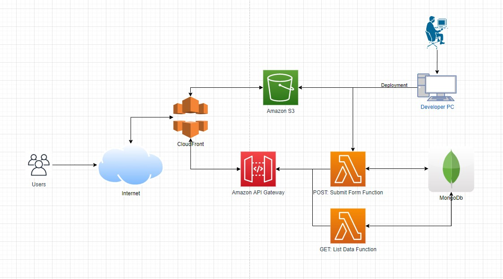
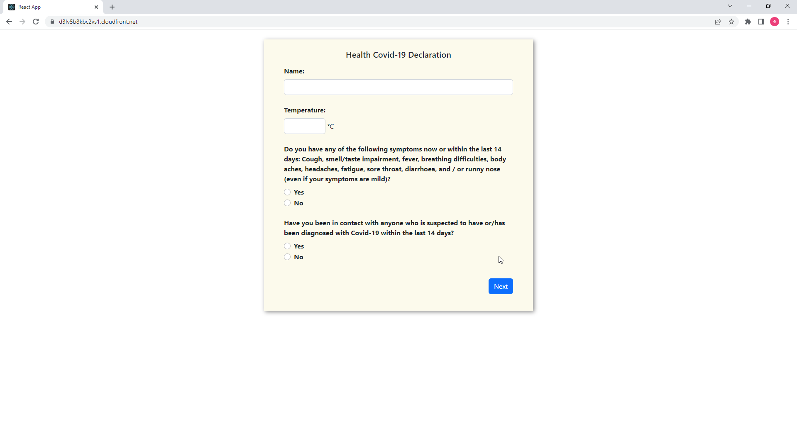
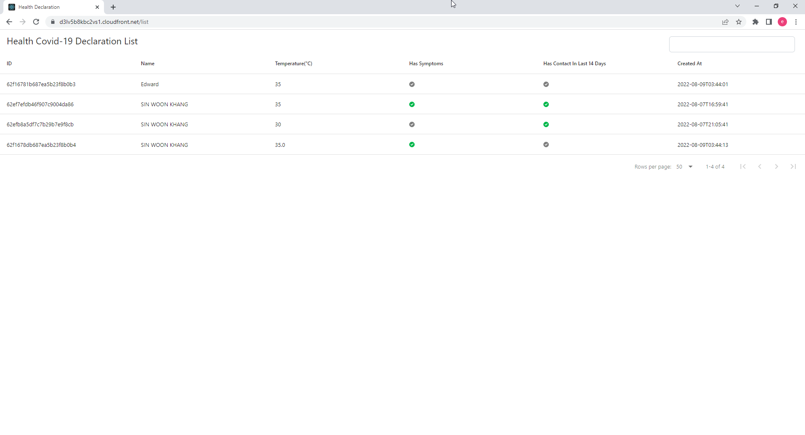

# Assignment - Health Declaration Frontend
## Description:
This is an assignment of Health Covid-19 declaration form.

## Pages:
- [Declaration Form Page](https://d3lv5b8kbc2vs1.cloudfront.net)
- [Declaration List Page](https://d3lv5b8kbc2vs1.cloudfront.net/list)

## Design Ideas:
1. Analyse and confirm the requirements.
1. Languages and tools consideration:
    1. Since it is an interview assignment, the languages and tools used in the assignment will be in the list of the job requirements.
    1. The convenience of using the same languages will not be considered since the target of the assignment is to show the skillset of the developer.
1. System architecture consideration:
    1. Scalability
    1. Availability
    1. Reliability
    1. Maintainability
1. Design the UI for the application.
1. Start working after the analysis.

## Screenshots:
System Architecture:
<kbd></kbd>
Declaration Form:
<kbd></kbd>

Declaration List:
<kbd></kbd>

## Development:
```
npm start
```

Runs the app in the development mode.\
Open [http://localhost:3000](http://localhost:3000) to view it in your browser.

The page will reload when you make changes.\
You may also see any lint errors in the console.

```
npm test
```
Run the unit tests for the assignment.

Unit tests included:
1. App.test.js
    1. check to render declaration form
1. FormInput.test.js
    1. check value call changed
    1. check to error message when it is not empty
1. DeclarationForm.test.js
    1. check submit with empty input
    1. check submit successfully

## Deployment:
```
npm run build
```

Builds the app for production to the `build` folder.\
It correctly bundles React in production mode and optimizes the build for the best performance.

The build is minified and the filenames include the hashes.\
Your app is ready to be deployed!
```
npm run deploy
```
AWS permission required for the deployment.
Static files will be deployed to S3.

## Work have done:
1. Declaration Form to submit
1. Declaration Table to display the submitted details
1. Unit tests for some cases in declaration form
1. Application deployment to the public
1. Git commit

## Work haven't done:
1. CI/CD setup